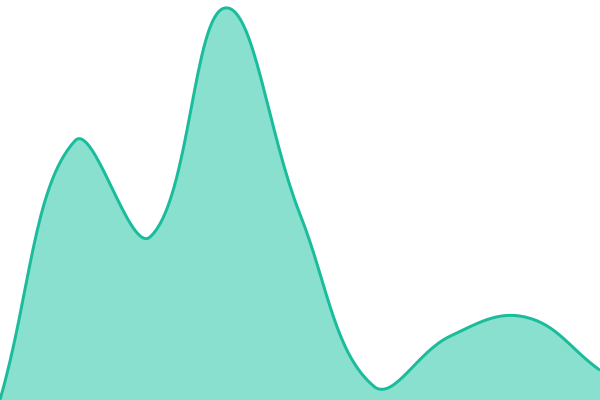
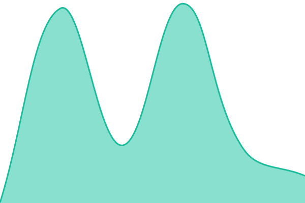
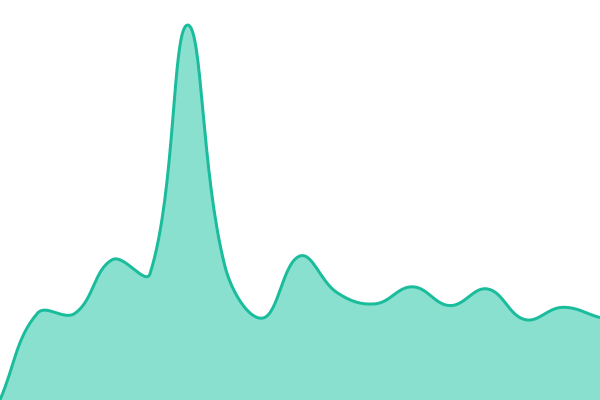
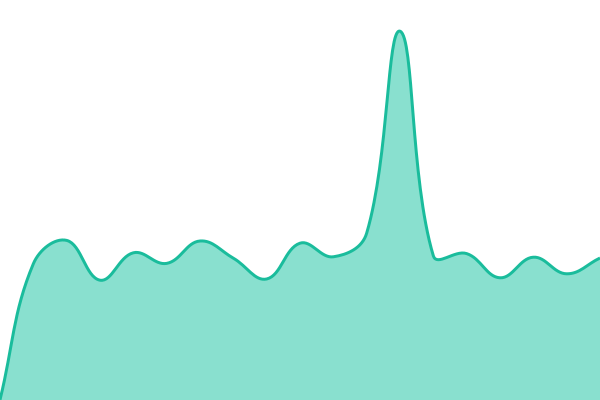

# [📈 Live Status](https://0xPufferFish.github.io/runa-status): <!--live status--> **🟩 All systems operational**

This repository contains the open-source uptime monitor and status page for [0xPufferFish](https://0xPufferFish.github.io/runa-status), powered by [Upptime](https://github.com/upptime/upptime).

With [Upptime](https://upptime.js.org), you can get your own unlimited and free uptime monitor and status page, powered entirely by a GitHub repository. We use [Issues](https://github.com/0xPufferFish/runa-status/issues) as incident reports, [Actions](https://github.com/0xPufferFish/runa-status/actions) as uptime monitors, and [Pages](https://0xPufferFish.github.io/runa-status) for the status page.

<!--start: status pages-->
<!-- This summary is generated by Upptime (https://github.com/upptime/upptime) -->
<!-- Do not edit this manually, your changes will be overwritten -->
<!-- prettier-ignore -->
| URL | Status | History | Response Time | Uptime |
| --- | ------ | ------- | ------------- | ------ |
|  [Catalog (runarent.com)](https://runarent.com/) | 🟩 Up | [catalog-runarent-com.yml](https://github.com/0xPufferFish/runa-status/commits/HEAD/history/catalog-runarent-com.yml) | 

 699ms
     
 | 

<a href="https://0xPufferFish.github.io/runa-status/history/catalog-runarent-com">100.00%</a>
    

|  [Catalog standby (catalog.runarent.com)](https://catalog.runarent.com/) | 🟩 Up | [catalog-standby-catalog-runarent-com.yml](https://github.com/0xPufferFish/runa-status/commits/HEAD/history/catalog-standby-catalog-runarent-com.yml) | 

 545ms
     
 | 

<a href="https://0xPufferFish.github.io/runa-status/history/catalog-standby-catalog-runarent-com">100.00%</a>
    

|  [API (www.api.runarent.com)](https://www.api.runarent.com/v1/attire/attributes) | 🟩 Up | [api-www-api-runarent-com.yml](https://github.com/0xPufferFish/runa-status/commits/HEAD/history/api-www-api-runarent-com.yml) | 

 773ms
     
 | 

<a href="https://0xPufferFish.github.io/runa-status/history/api-www-api-runarent-com">100.00%</a>
    

|  [API (api.runarent.com)](https://api.runarent.com/v1/attire/attributes) | 🟩 Up | [api-api-runarent-com.yml](https://github.com/0xPufferFish/runa-status/commits/HEAD/history/api-api-runarent-com.yml) | 

 855ms
     
 | 

<a href="https://0xPufferFish.github.io/runa-status/history/api-api-runarent-com">100.00%</a>
    

|  [Media (R2)](https://media.runarent.com/storage/v1/logo.webp) | 🟩 Up | [photos-r2.yml](https://github.com/0xPufferFish/runa-status/commits/HEAD/history/photos-r2.yml) | 

 200ms
     
 | 

<a href="https://0xPufferFish.github.io/runa-status/history/photos-r2">100.00%</a>
    

|  [Media (runa-1)](https://api.runarent.com/storage/v1/logo.webp) | 🟩 Up | [photos-storage.yml](https://github.com/0xPufferFish/runa-status/commits/HEAD/history/photos-storage.yml) | 

 883ms
     
 | 

<a href="https://0xPufferFish.github.io/runa-status/history/photos-storage">100.00%</a>
    

|  [Catalog sitemap](https://runarent.com/sitemap.xml) | 🟩 Up | [catalog-sitemap.yml](https://github.com/0xPufferFish/runa-status/commits/HEAD/history/catalog-sitemap.yml) | 

 958ms
     
 | 

<a href="https://0xPufferFish.github.io/runa-status/history/catalog-sitemap">100.00%</a>
    

|  [Catalog robots.txt](https://runarent.com/robots.txt) | 🟩 Up | [catalog-robots-txt.yml](https://github.com/0xPufferFish/runa-status/commits/HEAD/history/catalog-robots-txt.yml) | 

 588ms
     
 | 

<a href="https://0xPufferFish.github.io/runa-status/history/catalog-robots-txt">100.00%</a>
    

|  [Admin](https://admin.runarent.com/) | 🟩 Up | [panda-admin.yml](https://github.com/0xPufferFish/runa-status/commits/HEAD/history/panda-admin.yml) | 

 772ms
     
 | 

<a href="https://0xPufferFish.github.io/runa-status/history/panda-admin">100.00%</a>
    

<!--end: status pages-->

[**Visit our status website →**](https://0xPufferFish.github.io/runa-status)

## 📄 License

- Powered by: [Upptime](https://github.com/upptime/upptime)
- Code: [MIT](./LICENSE) © [Anand Chowdhary](https://anandchowdhary.com)
- Data in the `./history` directory: [Open Database License](https://opendatacommons.org/licenses/odbl/1-0/)
